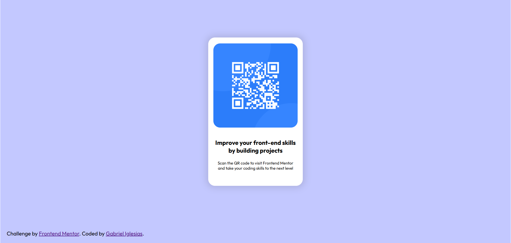

# Frontend Mentor - QR code component solution

This is a solution to the [QR code component challenge on Frontend Mentor](https://www.frontendmentor.io/challenges/qr-code-component-iux_sIO_H). Frontend Mentor challenges help you improve your coding skills by building realistic projects.

### Screenshot

### Links

- Solution URL: [Add solution URL here](https://your-solution-url.com)
- Live Site URL: [Add live site URL here](https://your-live-site-url.com)

## Author

- Website - [Gabriel Iglesias](https://gabrieliglesias.netlify.app/)
- Frontend Mentor - [@yourusername](https://www.frontendmentor.io/profile/iglesiasgm)
- Github - [@iglesiasgm](https://github.com/iglesiasgm)
- LinkedIN - [Gabriel Mariano Iglesias](https://www.linkedin.com/in/gabriel-mariano-iglesias-834767239/?trk=opento_sprofile_details)
